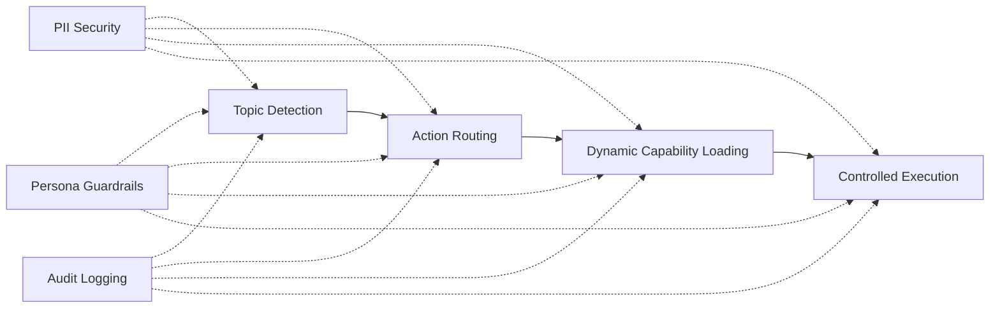
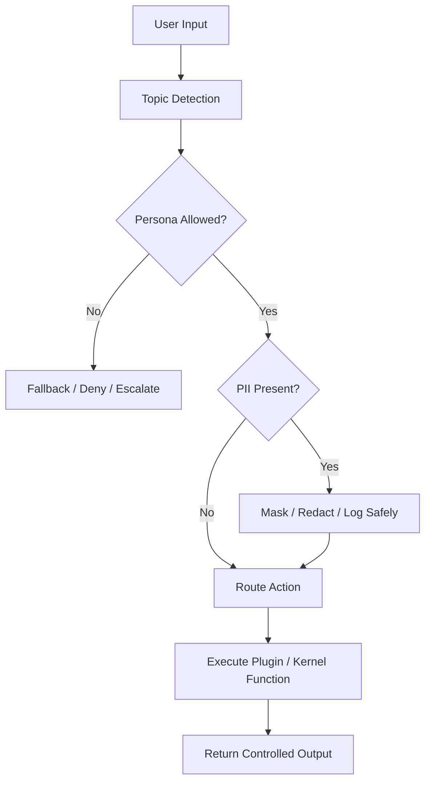

# Aimitra Topic-Action Framework  

## Executive Summary

Aimitra is evolving into a .NET-based topic-action framework that can classify user intent, route it to the right capability, and execute the correct tool or kernel function dynamically.

The goal is to move from a single-purpose application into a modular execution platform that can:
- understand a topic or request,
- choose the appropriate action pipeline,
- load new capabilities without code changes,
- and keep the system maintainable as use cases grow.

This POC to show future expertise in AI agent and this idea as a structured product direction.

## Problem Statement

Current assistants and automation apps often become hard to scale because every new capability gets hardcoded into the main application. That leads to:
- large startup projects,
- brittle conditional logic,
- slow change cycles,
- and growing risk when new integrations are added.

As the number of topics and actions increases, the application needs a clearer model for:
- routing,
- plugin discovery,
- function execution,
- and separation of concerns.

## Proposed Approach

The Aimitra topic-action framework introduces a layered model:
1. Topic detection
   - Identify the user’s intent or subject area.
   - Example: database query, route planning, security check, external knowledge lookup.

2. Action routing
   - Map the topic to a known action pipeline.
   - Example: SQL generation, kernel function execution, PII masking, plugin call, fallback response.

3. Dynamic capability loading
   - Load custom kernel functions or plugins from configuration.
   - This allows teams to add functionality by dropping in a DLL and updating config.

4. Controlled execution
   - Run only the selected tool chain.
   - Keep the core app stable while capabilities evolve independently.

5. PII-aware handling
   - Detect and mask sensitive data before prompts, logs, plugin calls, or external tool execution.
   - Prevent accidental exposure of personal, financial, or regulated data across the topic-action pipeline.

6. Persona-based guardrails
   - Enforce topic boundaries based on the active persona or role.
   - Example: a finance persona should only access finance-approved actions, while a support persona should only access support-approved actions.
   - Prevent a topic from crossing into a disallowed action path even if the model attempts to route it there.

## What Aimitra Demonstrates

Aimitra already shows the foundation for this architecture:
- SemanticKernel orchestration for LLM-driven execution.
- Database schema reasoning and SQL generation.
- PII masking during model/tool flow.
- Dynamic kernel plugin loading from configured assemblies.
- A separate semantic route service for intent-style routing.

PII security can be strengthened further by adding:
- configurable masking policies,
- redaction before logging,
- allow-list based field exposure,
- audit trails for sensitive tool execution,
- and safe defaults for any plugin that processes user content.

Persona guardrails can be strengthened further by adding:
- persona-to-topic allow lists,
- role-based action boundaries,
- approval checks before executing cross-domain actions,
- and explicit fallback behavior when a request falls outside the permitted persona scope.

This makes Aimitra a practical prototype for a general topic-action platform rather than just a single AI app.

## Business Value

Approval for this direction would support:
- faster delivery of new AI-driven capabilities,
- lower maintenance cost through modular plugins,
- better reuse across products and departments,
- clearer governance over what actions are allowed,
- and a safer path to scale because logic is isolated by topic.

Potential business outcomes include:
- internal assistant workflows,
- database and reporting automation,
- compliance-aware tool execution,
- domain-specific copilots,
- and plugin-based enterprise extensions.

## Technical Value

This framework is a strong fit for .NET because it can use:
- class libraries for reusable capabilities,
- dependency injection for orchestration,
- Semantic Kernel for tool execution,
- configuration-driven plugin loading,
- and strong typing for maintainability.

It supports a clean separation between:
- core platform code,
- topic routing logic,
- and independently deployable features.

## Risks And Mitigations

Main risks:
- architecture could become too broad if not governed,
- plugin loading can introduce compatibility issues,
- dynamic execution requires security controls,
- and PII can leak if data is passed between actions without masking.

Mitigations:
- use a strict plugin contract,
- approve assemblies through configuration only,
- apply validation before loading,
- keep topic/action boundaries well documented,
- mask or redact PII before tool invocation and logging,
- restrict sensitive fields from non-approved plugins,
- and enforce persona-based allow lists before a topic is allowed to trigger an action.

## Recommendation

Approve continuation of the Aimitra topic-action framework as a phased engineering effort.

Recommended next phase:
- formalize the topic/action contract,
- stabilize the plugin loading model,
- add sample implementations,
- define approval and security rules,
- and prepare a small pilot use case for business validation.

## Decision Requested

Approval is requested to continue the Aimitra idea as a modular .NET topic-action framework and move it into a controlled pilot implementation.
