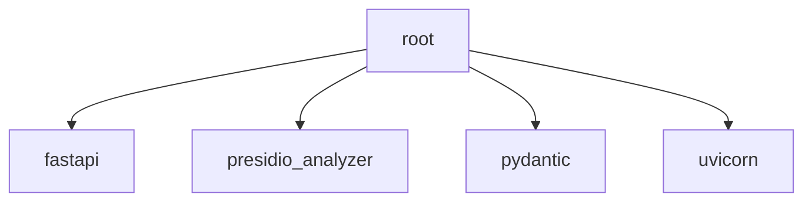

# Root Module

[← Back to INDEX](../../INDEX.md)

**Type:** root | **Files:** 28

## Files

| File | Lines | Large |
| ---- | ----- | ----- |
| `Aimitra.Console\Configuration\EnvFileLoader.cs` | 76 |  |
| `Aimitra.Console\Program.cs` | 307 |  |
| `Aimitra.Console\sementicRouter.cs` | 117 |  |
| `Aimitra.Core\Class1.cs` | 8 |  |
| `Aimitra.Core\Interfaces\IDbMetadataService.cs` | 18 |  |
| `Aimitra.Core\Models\DatabaseSchema.cs` | 138 |  |
| `Aimitra.SamplePlugins\Plugins\AstrologerPlugin.cs` | 26 |  |
| `Aimitra.SamplePlugins\Plugins\SampleGreetingPlugin.cs` | 14 |  |
| `Aimitra.Security\MaskingCore.cs` | 97 |  |
| `Aimitra.Security\PiiMaskingEngine.cs` | 170 |  |
| `Aimitra.SemanticRouteService\Models\SemanticRoute.cs` | 12 |  |
| `Aimitra.SemanticRouteService\SemanticRouter.cs` | 82 |  |
| `Aimitra.Services\Class1.cs` | 8 |  |
| `Aimitra.Services\Interfaces\IOpenRouterClient.cs` | 10 |  |
| `Aimitra.Services\Metadata\PostgresMetadataService.cs` | 273 |  |
| `Aimitra.Services\Metadata\SqlServerMetadataService.cs` | 262 |  |
| `Aimitra.Services\OpenRouter\OpenRouterClient.cs` | 116 |  |
| `Aimitra.Services\Orchestration\DatabaseQueryTool.cs` | 106 |  |
| `Aimitra.Services\Orchestration\ReasoningOrchestrator.cs` | 192 |  |
| `Aimitra.Services\Orchestration\ReasoningResult.cs` | 26 |  |
| `Aimitra.Services\Orchestration\SemanticKernelOrchestrator.cs` | 157 |  |
| `Aimitra.Services\Plugins\DatabasePlugin.cs` | 83 |  |
| `Aimitra.Services\Plugins\KernelPluginLoader.cs` | 149 |  |
| `Aimitra.Services\Plugins\KernelPluginOptions.cs` | 33 |  |
| `Aimitra.Tests\MetadataServiceTests.cs` | 39 |  |
| `Aimitra.Tests\SemanticKernelOrchestratorTests.cs` | 46 |  |
| `Aimitra.Tests\UnitTest1.cs` | 14 |  |
| `presidio_sever.py` | 20 |  |

---

| High 🔴 | Medium 🟡 | Low 🟢 |
| 1 | 0 | 0 |

## 🔴 High Priority

### `SAFETY` (Aimitra.Console\sementicRouter.cs:95)

> GUARD: Ensure both vectors are the exact same dimension
---

## External Dependencies

Dependencies from other modules:

- `fastapi`
- `presidio_analyzer`
- `pydantic`
- `uvicorn`
